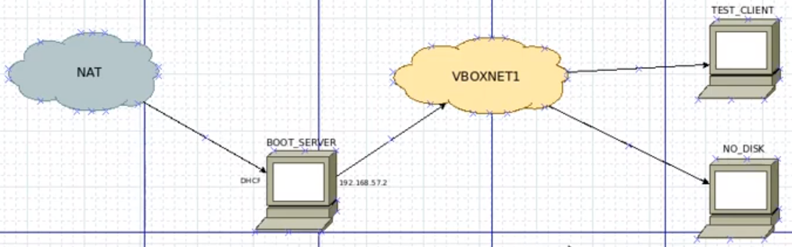

#  Linux commands and procedures

Usefull linux commands cheatset.

Contains some common task procedures.

If you wanna add or change something, make a pull request.

Will be updated continuously.

# Commands

## Terminal Key Bindings

|Keys|Action|
|----|------|
|`UP Arrow`, `DOWN Arrow`|moving throught personal command history|
|`CTRL + C`|exit command|
|`CTRL + Z`|stop command|
|`CTRL + U`|cut text before cursor|
|`CTRL + K`|cut text after cursor|
|`CTRL + Y`|restore previous text|
|`CTRL + W`|cut word before cursor|
|`ALT + .`|paste last command args|

## Utils

|Command / Location|Description|
|------------------|-----------|
|`!!`|execute last command|
|`sudo`|execute as root|
|`sudo !!`|execute last command as root|
|`sudo -i`|switch to root|
|`exit`|close current context|
|`echo $PATH`|prints current path values|
|`export PATH=$PATH:/sbin`|extend path with custom directory|
|`~/.bashrc`|run commands on bash start for user (login, ssh, ...)|
|`which bash`|prints command file location|
|`watch command`|executes command in interval and shows output|

## Power commands

|Command / Location|Description|
|------------------|-----------|
|`shutdown`, `shutdown -h`|shutdown in minute|
|`shutdown -h now`|shutdown now|
|`shutdown -r`|reboot in minute|
|`shutdown -r now`, `reboot`|reboot now|
|`shutdown -c`|cancel pending shutdown|

## Hardware
|Command / Location|Description|
|------------------|-----------|
|`nvidia-smi`|Nvidia GPU info|
|`lshw`|Hardware info|
|`cat /proc/cpuinfo`|CPU info|
|`neofetch`|System info|

## Packages

|Command / Location|Description|
|------------------|-----------|
|`apt update`|update local repositories packages lists|
|`apt install package_name`|install package|
|`apt upgrade`|update packages in system|
|`apt dist-upgrade`|update system packages|

## Networking

|Command / Location|Description|
|------------------|-----------|
|`wget http://example.com`|download file from web|
|`ip a`|show current network interfaces and configuration|
|`ifup enp0s8`|activate interface|
|`ifdown enp0s8`|deactivate interface|
|`dhclient enp0s8`|run DHCP client on interface|
|`dhclient -r`|renew DHCP IP Address|
|`dhcp-lease-list`|list DHCP clients on server|
|`/etc/network/interfaces`|permament interfaces configuration ([static](files/interfaces_static), [dhcp](files/interfaces_automatic))|

## Process management

|Command / Location|Description|
|------------------|-----------|
|`ps`|show current user processes|
|`top`|show processes|
|`htop`|show processes with gui|
|`kill -15 pid`|kill process|
|`kill -9 pid`|kill process without mercy|

## Services management

|Command / Location|Description|
|------------------|-----------|
|`service service_name start/stop/restart/reload`|start/stop/restart/reload service|
|`systemctl status service_name.service`|service status info|
|`systemctl enable service_name.service`|enable service to run|
|`systemctl daemon-reload`|reaload services configs|
|`/etc/systemd/**/*.service`|services configuration files|
|`journalctl --since yesterday -u service_name.service`|view service logs|

## Disk management

|Command / Location|Description|
|------------------|-----------|
|`mount`|show current mounted directories|
|`cfdisk /dev/sdb`|partition disk|
|`blkid`|get partitions ids and types|
|`ncdu`|compute space in dir and subdirs, has gui|
|`du -sh`|compute dir size|
|`df`|show partitions usages|
|`/etc/fstab`|automatic mount on boot (use `UUID` from `blkid`)|

## Files

|Command / Location|Description|
|------------------|-----------|
|`cat file_name`, `more file_name`, `less file_name`|read file contents|
|`nano file_name`, `vim file_name`, `echo 'text' > file_name`|write file contents|
|`ps > file_name`|redirect output to file (`write`)|
|`ps >> file_name`|redirect output to file (`append`)|
|`less +F file_name`|read file from end|

## Directories

|Command / Location|Description|
|------------------|-----------|
|`ls -alF`|list directory content|
|`ln -s from to`|creates symbolic link to location|
|`mc`|midnight commander (file manager)|

# Procedures

## Changing hostname

<table>
    <tr><td><code>nano /etc/hostname</code></td><td>change hostname</td></tr>
    <tr><td><code>nano /etc/hosts</code></td><td>change hosts file to match your new hostname</td></tr>
    <tr><td><code>reboot</code></td><td>reboot to apply changes</td></tr>
</table>

## Bash file

Can be executed using `./file_name`, if it has `x` attribute enabled.
To enable execution, use `chmod +x file_name`.

Basic structure
```
#!/bin/bash

commands
```
or
```
#!/usr/bin/env bash

commands
```

## Service file

Configure service to run some script/file. Usefull for agents, servers, jobs, timers, ...

[More info on how to create one.](https://medium.com/@benmorel/creating-a-linux-service-with-systemd-611b5c8b91d6)

Basic structure
```
[Unit]
Description=Service name
After=network.target
StartLimitIntervalSec=0

[Service]
Type=simple
Restart=always
RestartSec=1
User=centos
ExecStart=/usr/bin/env php /path/to/server.php

[Install]
WantedBy=multi-user.target
```

## Building kernel

### 1. Get kernel from web [kernel.org](https://kernel.org)

<table>
    <tr><td><code>wget https://cdn.kernel.org/pub/linux/kernel/v5.x/linux-5.11.tar.xz</code></td></tr>
</table>

### 2. Unpack kernel

<table>
    <tr><td><code>xz -d linux-5.11.tar.xz</code></td><td>decompress archive</td></tr>
    <tr><td><code>tar -xf linux-5.11.tar</code></td><td>split file to directory</td></tr>
    <tr><td><code>ln -s /usr/src/linux-5.11 linux</code></td><td>make symbolic link for build</td></tr>
    <tr><td><code>cd /usr/src/linux</code></td><td>go to build dir</td></tr>
</table>

### 3. Create configuration

<table>
    <tr><td><code>make localmodconfig</code></td><td>use current config</td></tr>
    <tr><td><code>make menuconfig</code></td><td>show menu to configure (don't forget to save)</td></tr>
</table>

### 4. Build kernel

<table>
    <tr><td><code>make -j 36</code></td><td>build using 36 parallel tasks (+- 2 * Logical processors)</td></tr>
    <tr><td><code>make -j 36 modules</code></td><td>build drivers & addons</td></tr>
</table>

### 5. Install kernel

<table>
    <tr><td><code>make -j 36 modules_install</code></td><td>/lib/modules/</td></tr>
    <tr><td><code>make -j 36 install</code></td><td>/boot/</td></tr>
    <tr><td><code>reboot</code></td><td>finaly reboot system and boot to your new kernel</td></tr>
    <tr><td><code>cat /proc/version</code></td><td>check current kernel version</td></tr>
</table>

## Network boot

### Boot server

Will be used for DHCP and for storing/distributing boot image to clients.


### 1. Configure static IP Address

<table>
    <tr><td><code>nano /etc/network/interfaces</code></td><td>edit network interfaces file</td></tr>
</table>

Append folowing lines to [file](files/interfaces_static). Change to fit your system and network.

This configures `enp0s8` interface to:

- use static IP address `192.168.26.2`
- with `netmask 255.255.255.0`
- and `broadcast 192.168.26.255`.

```
auto enp0s8
iface enp0s8 inet static
  address 192.168.26.2/24
```

<table>
    <tr><td><code>ifup enp0s8</code></td><td>activate interface</td></tr>
    <tr><td>
        <code>ifdown enp0s8</code> then <code>ifup enp0s8</code>
    </td><td>if interface is allready activated, deactivate interface and reactivate interface, to load changes</td></tr>
    <tr><td><code>ip a</code></td><td>check current status</td></tr>
</table>

### 2. Setting up DHCP Server

Configuration files [/etc/default/isc-dhcp-server](files/isc-dhcp-server) and [/etc/dhcp/dhcpd.conf](files/dhcpd.conf).

<table>
    <tr><td><code>apt install isc-dhcp-server</code></td><td>install dhcp server package</td></tr>
    <tr><td>---</td><td>---</td></tr>
    <tr><td><code>nano /etc/default/isc-dhcp-server</code></td><td>configure dhcp server</td></tr>
    <tr><td><code>INTERFACESv4="enp0s8"</code></td><td>add your interface to property</td></tr>
    <tr><td>---</td><td>---</td></tr>
    <tr><td><code>nano /etc/dhcp/dhcpd.conf</code></td><td>configure dhcp server</td></tr>
    <tr><td><code>option domain-name "example.com";</code></td><td>set domain</td></tr>
    <tr><td><code>option domain-name-servers 8.8.8.8, 1.1.1.1;</code></td><td>set name servers (DNS Servers)</td></tr>
    <tr><td><code>default-lease-time 600;</code></td><td>set time (seconds) between checks for ip by client</td></tr>
    <tr><td><code>subnet ...</code></td><td>set your subnet for dhcp</td></tr>
    <tr><td>---</td><td>---</td></tr>
    <tr><td><code>service isc-dhcp-server start</code></td><td>start dhcp service</td></tr>
    <tr><td><code>service isc-dhcp-server status</code></td><td>check dhcp service status</td></tr>
</table>

### 3. Setup NAT request translation

Allow forwarding requests from DHCP Clients to internet or other networks.

Temporary configuration:
<table>
    <tr><td><code>iptables -t nat -A POSTROUTING -o enp0s3 -j MASQUERADE</code></td><td>setup forwarding on interface <b>enp0s3</b> in table <b>nat</b></td></tr>
    <tr><td><code>echo 1 > /proc/sys/net/ipv4/ip_forward</code></td><td>enable ip forwarding</td></tr>
    <tr><td><code>iptables -t nat --list</code></td><td>list all rules in <b>nat</b> table</td></tr>
</table>

Persistent configuration:
<table>
    <tr><td><code>nano /etc/sysctl.conf</code> then uncomment <code>net.ipv4.ip_forward</code></td><td>enable ip forwarding</td></tr>
    <tr><td><code>apt install iptables-persistent</code></td><td>utility to manage iptables, copies config on install</td></tr>
    <tr><td><code>nano /etc/iptables/rules.v4</code> should contain configuration <code>-A POSTROUTING -o enp0s3 -j MASQUERADE</code></td><td>these rules are applied on reboot</td></tr>
    <tr><td><code>iptables -t nat --list</code></td><td>list all rules in <b>nat</b> table</td></tr>
</table>

### 4. Test DHCP Client

Ensure there is only one DHCP Server on network.

Connect with your client to network and check with `ip a`.

Use `dhclient -r` on client to renew IP Address;

Test outgoing connections to different networks using `ping`.

Use `dhcp-lease-list` to list all dhcp clients on server.

### 5. Install TFTP Server

Trivial file transfer protocol server. Used to transfer files to clients.

<table>
    <tr><td><code>apt install tftpd-hpa</code></td><td>install TFTP server package</td></tr>
    <tr><td><code>nano /etc/default/tftpd-hpa</code></td><td>configure TFTP server (optional)</td></tr>
    <tr><td><code>echo 'Test' > /srv/tftp/test</code></td><td>create test file</td></tr>
</table>

### 6. Test TFTP Client

<table>
    <tr><td><code>apt install tftp-hpa</code></td><td>install TFTP client package</td></tr>
    <tr><td><code>tftp 192.168.26.2</code></td><td>connect to TFTP server</td></tr>
    <tr><td><code>binary</code></td><td>switch to binary mode</td></tr>
    <tr><td><code>get test</code></td><td>download test file</td></tr>
    <tr><td><code>quit</code></td><td>close connection</td></tr>
    <tr><td><code>cat test</code></td><td>read downloaded file</td></tr>
</table>

### 7. Configure network boot on server

Clients will download `pxelinux.0` from server `192.168.26.2` using TFTP.

<table>
    <tr><td><code>nano /etc/dhcp/dhcpd.conf</code></td><td>configure DHCP to use network boot</td></tr>
    <tr><td>Add <code>next-server 192.168.26.2;</code> and <code>filename "pxelinux.0";</code> to subnet</td><td>add network server and image filename</td></tr>
    <tr><td><code>dhcpd -t</code></td><td>check DHCP configuration</td></tr>
    <tr><td><code>service isc-dhcp-server restart</code></td><td>restart DHCP service</td></tr>
    <tr><td><code>cd /srv/tftp</code></td><td>move to TFTP directory</td></tr>
    <tr><td><code>wget http://ftp.debian.org/debian/dists/stretch/main/installer-amd64/current/images/netboot/netboot.tar.gz</code></td><td>download netboot</td></tr>
    <tr><td><code>gzip -d netboot.tar.gz</code></td><td>decompress netboot</td></tr>
    <tr><td><code>tar -xf netboot.tar</code></td><td>split netboot to files</td></tr>
</table>

### 8. Test network boot on client

Connect client to network, and choose to boot from network.

Client will download `pxelinux.0` from server `192.168.26.2` using TFTP and show menu.

### 9. Setup NFS server

Map directories to clients.

<table>
    <tr><td><code>apt install nfs-kernel-server</code></td><td>install NFS server</td></tr>
    <tr><td><code>mkdir /remote_root</code></td><td>create remote boot directory</td></tr>
    <tr><td><code>nano /etc/exports</code></td><td>configure NFS server</td></tr>
    <tr><td><code>/remote_root&nbsp;192.168.26.0/24(rw,async,no_root_squash)</code></td><td>boot from <b>/remote_root</b> directory for subnet <b>192.168.26.0/24</b></td></tr>
    <tr><td><code>/home&nbsp;192.168.57.0/24(rw,async)</code></td><td>map home directory for subnet <b>192.168.26.0/24</b></td></tr>
    <tr><td><code>service nfs-kernel-server restart</code></td><td>restart NFS server</td></tr>
    <tr><td><code>echo 'Test' > /remote_root/test</code></td><td>create test file</td></tr>
</table>

### 10. Test mount on client

<table>
    <tr><td><code>apt install nfs-client</code></td><td>install NFS client</td></tr>
    <tr><td><code>mount 192.168.26.2:/remote_root /mnt/</code></td><td>mount NFS server to /mnt</td></tr>
    <tr><td><code>cat /mnt/test</code></td><td>read test file</td></tr>
</table>

### 11. Create our network boot system

Map parts our system for client to boot from.

Copy directories to `/remote_boot`. Create others.

```
bin -> cp
boot -> cp
dev
etc -> cp
home
lib -> cp
lib64 -> cp
media
mnt
opt -> cp
proc
root -> cp
run
sbin -> cp
srv -> cp
sys
tmp
usr -> cp
var -> cp
```

<table>
    <tr><td><code>chmod 777 tmp</code></td><td>fix tmp permissions</td></tr>
    <tr><td><code>chmod o+t tmp</code></td><td>fix tmp permissions</td></tr>
</table>

Prepare pxelinux stucture from debian-installer:
```
Debian
ldlinux.c32
libcom32.c32
libutil.c32
pxelinux.cfg
pxelinux.0
vesamenu.c32
stdmenu.cfg
splash.png
```

Setup pxelinux.cfg/default
```
DEFAULT vesamenu.c32
INCLUDE stdmenu.cfg
PROMPT 0
TIMEOUT 50

MENU TITLE  Boot Menu

LABEL Debian - NetBoot
KERNEL /Debian/vmlinuz-4.19.0-14-amd64
APPEND initrd=/Debian/initrd.img-4.19.0-14-amd64 root=/dev/nfs nfsroot=192.168.26.2:/remote_root ip=dhcp rw
```

### 12. Test boot from client

Try booting client, should load our kernel.

### 13. Fix errors

Distable all interfaces in `/remote_root/etc/network/interfaces` except of `lo`.

Remove disks in `/remote_root/etc/fstab`.

---

<p align="center">
    <b><a href="https://github.com/MGSE97" target="_blank">MGSE97</a> 🔥 2021</b>
</div>
